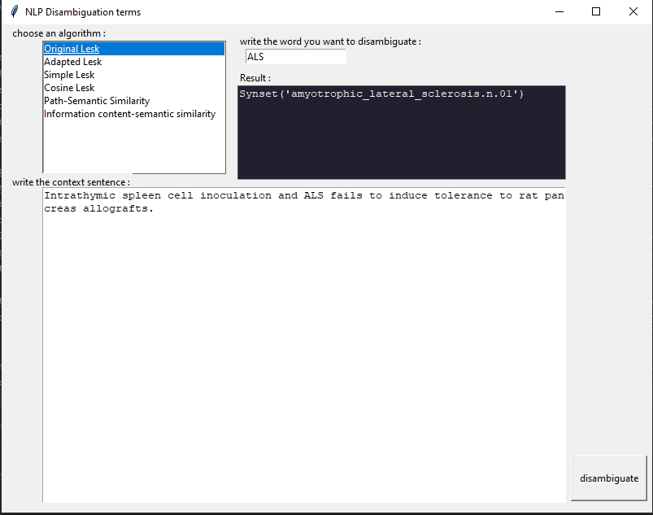

# NLP

WordSense Disambiguation in Medical Context, please read the documentation to get a link for the dataset as it is not freely published, you will find it in section 4 of the dataset (end of page 2)


We used pywsd, a Python Implementations of Word Sense Disambiguation (WSD) Technologies we modified some parts to fit our needs.
You can find the original with this link : https://github.com/alvations/pywsd

Liling Tan. 2014. Pywsd: Python Implementations of Word Sense Disambiguation (WSD) Technologies [software]. Retrieved from https://github.com/alvations/pywsd

To use our project correctly please follow these steps:

* Clone the repository
* install the needed packages with the requirements.txt file :
```bash
pip install requirements.txt
```
* download the dataset from the repport or ask the official owner with this link ()
* go in the main file and be sure you are running the import utils the first time (you can comment it after, you just need to run it once)
* choose the parts of our project you want to use. The GUI is part 7. For others please check the description (https://github.com/Wa-wann/NLP/blob/master/project-description.md)

-------------------------------------------------

